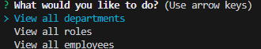
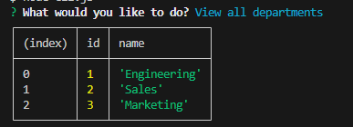

# SQLTrackTheEmployees

## description

This is a command-line application for managing a companies employee database. As developers want to create an interface that non-devlopers can use, we have created something in the command line that provides functionality for managing departments roles and employees allowing owners to organize and take care of their business. 

## details

-Allows user to view departments, roles, and employees
-Allows updates and adding employees / their roles through dbeaver
-Update or Delete tables through dbever changes will be linked to commandline panel

## technologies used

Node.js
PostgreSQL
Inquirer.js 8.2.4 version

## Usage
in order to start the application, 
the user will have to right click cli.js and open the integrated terminal. After installing necessary packages with the 

npm install inquirer@8.2.4 pg 

and executing 

node cli.js 

a prompt will appear 

upon using arrow keys and enter key, the user will be able to see the department / roles / employees. 

## Demonstration

https://app.screencastify.com/v3/watch/Ot1l5prNCVZQbtBPrMpD

## Credits

to the Instructors and Staff at Columbia University Coding Bootcamp

## License

This project uses the MIT License.